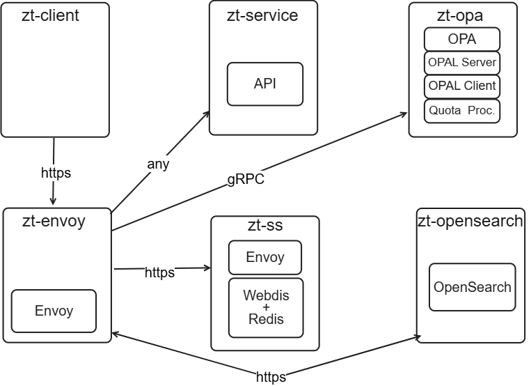

# Simplificando a adoção de ZTA com Motor de Políticas e Decisões Baseadas em _Logs_

**Resumo do artigo:**

A arquitetura de microsserviços e a popularização de provedores de nuvem como serviço introduziram desafios de cibersegurança. Perímetros de rede dinâmicos, superfícies de ataque ampliadas e comunicações complexas invalidam modelos tradicionais baseados em perímetros estáticos.  
Este trabalho apresenta duas abordagens de controle de acesso como pontos de partida para a adoção de _Zero Trust_: uma baseada em motor de políticas com quotas multifator e outra em análise de _logs_ e alertas para definir penalidades. A simples adição de inteligência a um _proxy_ padrão com as arquiteturas propostas permite elevar o nível de maturidade na adoção de _Zero Trust_ de básico ou intermediário para avançado em vários aspectos.  
As abordagens foram avaliadas em ambientes simulados, e os resultados demonstram eficácia na identificação de irregularidades e no aumento da segurança, bloqueando ataques em até 4 segundos, além da viabilidade em termos de latência e facilidade de adoção.


# Estrutura do readme.md

Este documento está organizado de forma a orientar o processo de instalação, execução e avaliação do artefato. As seções descritas a seguir cobrem desde informações básicas e requisitos, até instruções para replicação dos experimentos descritos no artigo.

As seções presentes neste README incluem:

1. **Título e Resumo:** Apresenta o título do projeto e o resumo técnico do artigo.
2. **Estrutura do readme.md:** Explica a organização deste documento e do repositório como um todo.
3. **Selos Considerados:** Define quais selos foram considerados para avaliação do artefato.
4. **Informações básicas:** Detalha o ambiente de execução necessário (hardware e software).
5. **Dependências:** Lista bibliotecas, ferramentas e benchmarks exigidos, com instruções de instalação.
6. **Preocupações com segurança:** Informa se há riscos e como mitigá-los.
7. **Instalação:** Passos para instalar e executar o sistema.
8. **Teste mínimo:** Instruções para validar o funcionamento básico do artefato.
9. **Experimentos:** Passo a passo para replicação das principais reivindicações experimentais do artigo.
10. **Licença:** Informação sobre os termos de uso do código-fonte.

O repositório está organizado da seguinte forma:

```
.
├── commons/              # Componentes compartilhados entre os mecanismos de política e de logs
│   ├── certs/            # Certificados CA para autenticação mTLS
│   ├── envoy-no-filters/ # Proxy Envoy sem filtros para baseline
│   ├── scripts/          # Scripts auxiliares comuns
│   ├── service/          # Serviço upstream simulado
│   └── state-storage/    # Armazenamento de estado (Redis e Webdis)
├── logs-engine/          # Implementação baseada em análise de logs (OpenSearch)
│   ├── assets/           # Diagramas de arquitetura e apoio
│   ├── docs/             # Documentação do mecanismo baseado em logs
│   ├── envoy-service/    # Configuração do Envoy Proxy
│   ├── opensearch/       # Configuração e setup do OpenSearch
│   └── scripts/          # Scripts específicos da engine de logs
├── policy-engine/        # Implementação baseada em políticas (OPA)
│   ├── assets/           # Diagramas de arquitetura e apoio
│   ├── docs/             # Documentação do mecanismo baseado em políticas
│   ├── envoy-service/    # Configuração do Envoy Proxy
│   ├── opa-policies/     # Políticas Rego do Open Policy Agent
│   └── scripts/          # Scripts específicos da engine de políticas
└── tests/                # Testes e dados utilizados na avaliação experimental
├── data-experiment-opa/         # Dados dos experimentos com o mecanismo OPA
├── data-experiment-opensearch/ # Dados dos experimentos com OpenSearch
├── data-experiment-proxy/      # Dados de referência para o proxy sem filtros
└── scripts/                    # Scripts auxiliares para rodar os testes
```

# Selos Considerados

Os selos considerados são: **Disponíveis** e **Sustentáveis**. Ambas as implementações (Policy Engine e Log Analysis) podem ser executadas independentemente para demonstrar os princípios de Zero Trust em diferentes cenários.

# Informações básicas

Este artefato propõe duas abordagens complementares para controle de acesso em uma arquitetura baseada nos princípios de Zero Trust (ZTA):

1. **Policy Engine**: uma abordagem baseada em políticas explícitas escritas em Rego e avaliadas pelo _Open Policy Agent (OPA)_, com suporte a decisões dinâmicas e controle de quotas com múltiplos fatores contextuais.

2. **Log Analysis Engine**: uma abordagem reativa baseada na análise contínua de _logs_ utilizando o _OpenSearch_ para detectar padrões anômalos, gerar alertas e aplicar penalidades em tempo real.

Ambas as abordagens compartilham componentes como proxies Envoy e armazenamento de estado, mas seguem estratégias distintas e complementares para tomada de decisão. A seguir, detalham-se as principais funcionalidades de cada uma das abordagens.

### Policy Engine (baseado em OPA)

Esta abordagem aplica os princípios de Zero Trust Architecture (ZTA) para decisões de acesso baseadas em políticas explícitas e dinâmicas, utilizando o Open Policy Agent (OPA) como mecanismo central de decisão. Os principais destaques da implementação incluem:

- **Rate limiting com quotas por usuário e custo por endpoint:** O sistema implementa uma estratégia de alocação de recursos baseada em "CPU coins", que associa custos a cada endpoint da API. Isso garante que usuários respeitem seus limites de uso dentro de uma janela de tempo configurada, preservando o desempenho e estabilidade do sistema.

- **Gerenciamento de quotas sensível ao contexto:** Uma funcionalidade de "modo noturno" foi implementada para ajustar quotas de acesso com base no horário. Projetos com alta demanda fora do horário comercial podem ser beneficiados com menos restrições, enquanto outros são limitados para prevenir comportamento anômalo.

- **Controle de acesso fino baseado em identidade:** Políticas de autorização consideram SPIFFE IDs e o endpoint acessado. Essa granularidade permite restringir acessos de forma precisa, mitigando riscos de acesso indevido e vazamento de dados.

- **Políticas dinâmicas e adaptativas:** OPA pode receber dados externos que identificam comportamentos anômalos e adaptar decisões de acesso em tempo real. Isso garante respostas rápidas a incidentes e contextos de risco emergentes.

### Log Analysis Engine (baseado em OpenSearch)

Esta abordagem complementa o modelo baseado em políticas ao introduzir um mecanismo de **monitoramento contínuo** e **resposta adaptativa** com base em logs de acesso. O sistema analisa o comportamento de usuários e recursos ao longo do tempo, promovendo decisões de autorização fundamentadas no histórico recente e na confiabilidade observada.

Os principais diferenciais incluem:

- **Ajuste dinâmico de penalidades:** Com base em eventos registrados nos logs, o sistema avalia padrões de uso anômalos, abusivos ou fora de conformidade. Quando violações de políticas são detectadas, penalidades são aplicadas automaticamente ao usuário ou recurso, limitando seu acesso de forma temporária ou escalonada.

- **Avaliação contínua da confiança:** Cada requisição é analisada não apenas em seu conteúdo individual, mas também no contexto do histórico de comportamento. A confiança de sujeitos e recursos é recalculada dinamicamente, garantindo que decisões de acesso reflitam o estado atual do ambiente.

- **Resposta autônoma a incidentes:** Alertas de segurança são gerados automaticamente a partir da análise de logs. Esses alertas desencadeiam mecanismos de mitigação locais, que podem restringir ou negar acessos futuros sem intervenção manual.

- **Integração entre observabilidade e controle de acesso:** A plataforma de observabilidade (OpenSearch) deixa de ser apenas uma ferramenta de análise passiva e passa a atuar como um **componente ativo de segurança**, influenciando diretamente as decisões de autorização com base em evidências comportamentais.

Essa abordagem garante que a política de acesso não seja estática, mas sim **sensível ao comportamento e contexto**, promovendo um ciclo contínuo de auditoria, aprendizado e reforço — alinhado aos princípios centrais de Zero Trust.

## Componentes

A arquitetura do sistema é composta por dois mecanismos principais — _Policy Engine_ e _Log Analysis Engine_ — que operam em conjunto com componentes compartilhados (_Commons_) para oferecer uma infraestrutura de segurança baseada nos princípios de Zero Trust. Abaixo estão descritos os principais componentes:



### Policy Engine (OPA-based)

- **OPA (Open Policy Agent):** Engine de políticas responsável por realizar decisões de autorização baseadas em regras escritas em Rego.
- **OPAL (Open Policy Administration Layer):** Camada de administração que permite atualizações dinâmicas das políticas no OPA, sincronizando configurações e dados em tempo real.
- **Quota Processor (Usage Tracker):** Componente responsável por rastrear o uso de recursos e aplicar quotas, viabilizando mecanismos de rate limiting por identidade.
- **Envoy Proxy (ext_authz):** Proxy de comunicação entre clientes e serviços internos, com suporte para autorização externa (gRPC/ext_authz).

### Log Analysis Engine (OpenSearch-based)

- **OpenSearch:** Plataforma de busca e análise de logs, utilizada para detectar padrões de comportamento e gerar alertas de segurança em tempo real.
- **Redis + Webdis:** Sistema de armazenamento de estado utilizado para registrar penalidades e decisões baseadas em eventos de segurança detectados via logs.
- **Envoy Proxy (Lua-based):** Versão customizada do Envoy com scripts Lua embutidos para decisões de acesso locais.

### Commons

- **Service (zt-service):** Serviço simulado utilizado para testes de autorização e comunicação segura dentro da arquitetura.

### Requisitos Mínimos de Hardware para Execução Local

Para garantir a execução adequada dos componentes do sistema e dos experimentos descritos no artigo, é recomendado que o ambiente de execução atenda aos seguintes requisitos mínimos de hardware:

- **CPU:** 8 núcleos (cores)
- **Memória RAM:** 16 GB

Esses requisitos são especialmente relevantes para ambientes que executam simultaneamente múltiplos contêineres, incluindo OpenSearch, Redis, Envoy, OPAL Server, OPA e serviços auxiliares. Embora o sistema possa ser adaptado para ambientes com menor capacidade em testes pontuais, recomenda-se a configuração acima para replicar os experimentos de forma fluida, com baixa latência e sem degradação de desempenho durante cenários com alta carga de requisições e monitoramento ativo.

# Dependências

A execução do artefato depende de algumas ferramentas e bibliotecas externas, necessárias tanto para a configuração do ambiente quanto para a realização dos testes e experimentos. Abaixo estão listadas as principais dependências:

- **Docker:** Plataforma de contêineres usada para isolar e orquestrar os diversos componentes da arquitetura (OpenSearch, OPA, Redis, Envoy etc.).
- **OpenSSL:** Utilitário utilizado para geração e manipulação de certificados TLS, especialmente na configuração do mTLS com SPIFFE.
- **cURL:** Ferramenta de linha de comando para testar endpoints e interagir com serviços RESTful.
- **Vegeta:** Ferramenta de _load testing_ utilizada para simular requisições e medir o comportamento do sistema sob carga, especialmente em testes de rate limiting e latência.
- **Python 3:** Necessário para scripts de automação, geração de dados e execução de tarefas auxiliares.
- **SQLite:** Banco de dados leve utilizado para armazenar métricas e registros locais durante a avaliação dos experimentos.

# Preocupações com segurança

Este artefato foi projetado para execução segura em ambiente local e isolado. As principais preocupações foram mitigadas da seguinte forma:

- **Certificados:** Todos os certificados TLS foram gerados por uma CA própria para testes. Eles estão localizados em `commons/certs/` e não têm validade externa.

- **Ambiente isolado:** Toda a execução ocorre via contêineres Docker, sem comunicação com serviços externos. Isso evita riscos de vazamento ou interferência.

- **Credenciais:** O OpenSearch utiliza uma senha padrão (`admin/admin`) adequada apenas para fins de teste. A senha pode ser alterada facilmente, se necessário.

Essas configurações garantem que o sistema possa ser executado sem riscos para os avaliadores.

# Instalação

Abaixo estão os passos necessários para preparar o ambiente completo e executar os componentes do artefato em contêineres Docker. Cada passo representa um módulo da arquitetura:

1. **Clonar o repositório:**

```bash
git clone https://github.com/AbraaoCF/zero-trust.git && cd zero-trust
````

2. **Gerar os certificados TLS:**

```bash
cd commons/certs && bash create_certs.sh
```

3. **Iniciar serviços comuns:**

* **Serviço simulado:**

```bash
cd commons/service && docker compose up -d
```

* **Envoy sem filtros (baseline):**

```bash
cd commons/envoy-no-filters && docker compose up -d
```

4. **Iniciar Policy Engine:**

* **Envoy Proxy:**

```bash
cd policy-engine/envoy-service && docker compose up -d
```

* **Stack OPA (OPA, OPAL Server, OPAL Client, Quota Processor):**

```bash
cd policy-engine && docker compose up -d
```

5. **Iniciar Log Analysis Engine:**

* **OpenSearch (modo single-node com painel):**

```bash
cd logs-engine/opensearch && docker compose up -d
```

* **Envoy Proxy:**

```bash
cd logs-engine/envoy-service && docker compose up -d
```

* **Armazenamento de estado (Redis + Webdis):**

```bash
cd commons/state-storage && docker compose up -d
```

6. **Criar entradas DNS locais (em `/etc/hosts`):**

Adicione os seguintes registros apontando para `127.0.0.1` (se estiver executando o sistema em uma única máquina):

```
127.0.0.1 envoy.zt.local
127.0.0.1 opensearch.zt.local
127.0.0.1 envoy-service.zt.local
127.0.0.1 opa.zt.local
127.0.0.1 state-storage.zt.local
127.0.0.1 service.zt.local
```

> **Observação:** Para obter medições mais precisas de consumo de CPU, execute apenas uma das engines por vez durante os testes.

Após esses passos, o ambiente estará pronto para execução dos testes mínimos e experimentos descritos nas seções seguintes.

# Teste mínimo

Para verificar se o ambiente foi configurado corretamente e os componentes principais estão funcionando, execute a requisição abaixo. Esse teste utiliza o certificado do usuário `normal` para acessar o endpoint protegido `/items` via Envoy Proxy.

```bash
curl \
  --cert commons/certs/normal.crt \
  --key commons/certs/normal.key \
  --cacert commons/certs/ca.crt \
  https://envoy.zt.local:8001/items
```

> **O que verificar:** A resposta esperada é um objeto JSON retornado pelo serviço simulado (`zt-service`), indicando que o Envoy autorizou a requisição com base nas políticas ou no nível de penalidade atual.

Esse teste básico permite validar rapidamente o funcionamento da cadeia mTLS, da resolução DNS local, e do pipeline de autorização.

# Experimentos

Esta seção descreve como configurar e executar os experimentos utilizados para validar as abordagens propostas no artigo.

- OpenSearch – Monitores

Antes de executar os experimentos, é necessário configurar os monitores de alerta no OpenSearch. Esses monitores analisam logs e métricas para identificar comportamentos anômalos com base nas seguintes políticas:

| Política                         | Tipo     | Limiar          | Janela de Tempo | Severidade |
|----------------------------------|----------|------------------|------------------|------------|
| Quantidade de requisições       | Sujeito  | > 1000           | 10 minutos       | Alta (4)   |
| Duração das requisições         | Sujeito  | > 10.000 ms      | 10 minutos       | Alta (3)   |
| Quantidade de requisições negadas | Sujeito | > 100            | 60 minutos       | Média (2)  |
| Quantidade de alertas gerados   | Sujeito  | > 10             | 240 minutos      | Baixa (1)  |
| Consumo de CPU                  | Global   | > 80%            | 10 minutos       | Alta (3)   |
| Consumo de memória              | Global   | > 70%            | 10 minutos       | Média (2)  |

- Monitoramento de containers

Utilize o script de monitoramento disponível para capturar consumo de recursos dos contêineres durante a execução dos experimentos:

```bash
bash commons/scripts/monitoring.sh <nomes-dos-containers>
````

Substitua `<nomes-dos-containers>` pelos nomes dos serviços Docker que deseja monitorar, como `opa`, `envoy`, `opensearch`, entre outros.

- OPA

Nenhuma configuração adicional é necessária além da inicialização da stack OPA/OPAL.

Para simular os cenários de testes descritos no artigo, execute:

```bash
bash tests/scripts/experiment.sh
```

Esse script gera arquivos `.raw` com os dados brutos de cada execução. Esses dados podem ser analisados utilizando a ferramenta Vegeta para produzir relatórios de performance e comportamento do sistema.

Os resultados esperados incluem métricas como latência, quantidade de requisições aceitas/negadas, alertas gerados, e penalidades aplicadas — alinhados às reivindicações descritas no artigo.

# LICENSE

Este repositório está licenciado sob a Licença MIT. Consulte o arquivo [LICENSE](LICENSE) para mais informações.
