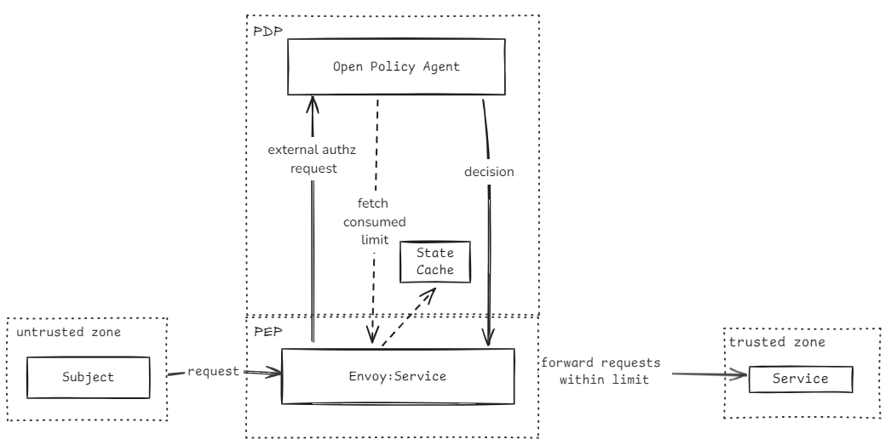

# Zero Trust Architecture with OPA Engine approach 

This repository proposes a solution using the Open Policy Agent (OPA) as a tool to meet Zero Trust standards. 
## Sumary

- [Zero Trust Architecture with OPA Engine approach](#zero-trust-architecture-with-opa-engine-approach)
  - [Sumary](#sumary)
  - [Motivation](#motivation)
  - [What was achieved](#what-was-achieved)
  - [Architecture](#architecture)
  - [Understanding the policy](#understanding-the-policy)
  - [Usage](#usage)
    - [Prerequisites](#prerequisites)
    - [Start the system](#start-the-system)
  - [Contributing](#contributing)
  - [License](#license)

## Motivation

In the context of the "PDI in Business Intelligence Applied to University Management" initiative, the system receives data from Envoy, utilizing SPIFFE IDs to authenticate clients. However, the current setup presents several challenges in managing access control and resource usage effectively. Specifically, Envoy lacks built-in mechanisms for implementing fine-grained rate limiting, which is essential for distinguishing between legitimate and potentially malicious users.

The inability to enforce rate limits at a more granular level could result in good users being unfairly restricted, while bad actors might still exploit the system. This problem is further compounded by the fact that different API endpoints have varying resource costs, with some being significantly more CPU-intensive than others. Consequently, a one-size-fits-all approach to rate limiting is insufficient.

To address these issues, this thesis proposes the integration of Open Policy Agent (OPA) into the system. OPA offers a fast, straightforward, and contextless solution for fine-grained authorization, allowing for more precise control over user access based on their SPIFFE ID and environment informations. Additionally, OPA's flexibility and minimal infrastructure requirements make it an ideal choice for enhancing security and resource management without the need for a complex architectural overhaul.

By leveraging OPA, the system can implement dynamic, context-aware policies that consider both the identity of the user and the specific API endpoint being accessed. This approach aims to optimize resource usage while ensuring that legitimate users can continue to access the system without unnecessary restrictions, ultimately contributing to the overall effectiveness of the business intelligence initiative.

## What was achieved

Throughout this project, several key achievements were made in implementing a Zero Trust Architecture (ZTA) with Open Policy Agent (OPA) to enhance the security and access control of the API system managing datasets. 

Firstly, the motivation behind the project was addressed by leveraging advanced data management and analysis techniques by adopting ZTA principles and integrating OPA, the project aimed to ensure the protection of critical data from unauthorized access and misuse while maintaining flexibility for academic and research purposes.

 - **Rate limit with budget per user and endpoint cost**s: The project implemented a rate-limiting strategy that allocates CPU coins to users and associates costs with API endpoints. This approach ensures that users cannot exceed their allocated CPU resources within a defined time window, thereby preventing resource monopolization and maintaining system performance and stability.

 - **Environment-aware budget management**: To account for environmental aspects, a "night mode" feature was implemented to adjust project budgets based on working hours. Projects with higher throughput needs outside normal working hours can take advantage of reduced system load, while those with lower demand during these times are budget-restricted to prevent abnormal behavior.

 - **Fine-grained access control**: The project implemented fine-grained access control policies based on SPIFFE IDs and API endpoints. By enforcing strict verification of identity and context, the system can prevent unauthorized access and misuse of resources, reducing the risk of security breaches and data loss.

 - **Dynamic and responsive security policies**: Anomalies can be detected by an external service and pushed to OPA for real-time access control adjustments. By allowing external systems to interact with OPA and adjust policies based on observed behaviors, the system can adapt to changing contexts and behaviors, enhancing overall security and responsiveness.

## Architecture

This is the propposed architecture:



## Understanding the policy

To understand the rationale behind the policy decisions and what do they cover go to [policy-decisions.md](./docs/policy-decisions.md).

## Usage

### Prerequisites

 - Docker ([How to install docker](https://docs.docker.com/engine/install/))

### Start the system

To start the system just use docker and run the following comand on the root directory:

```bash
docker-compose up --build -d
```

This should run the following containers and its respective ports:
 - ext_authz-opa-service: `8181:8181` used to inject data and `9002:9002` used for gRPC communication
 - envoy: `10000:10000`
 - hello-word service: `5678:5678`
 - webdis: `7379:7379`


## Contributing

Please open an issue or submit a pull request for any changes or improvements.

## License

This repository is licensed under the MIT License. See the [LICENSE](../LICENSE) file for more information.
